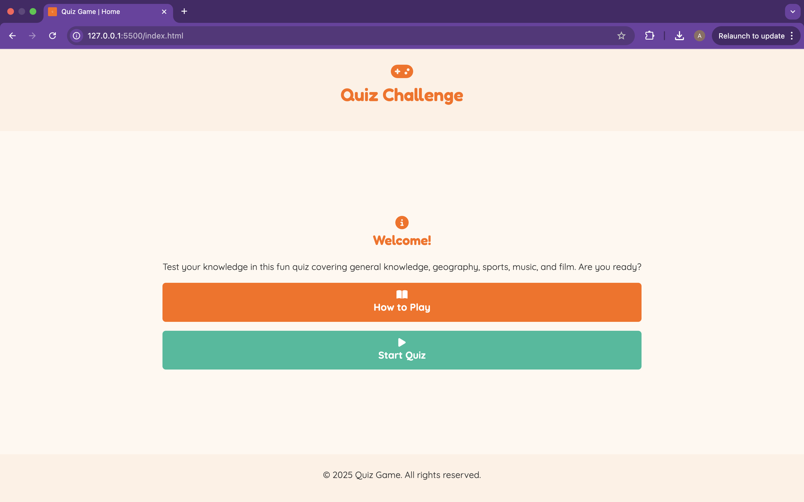
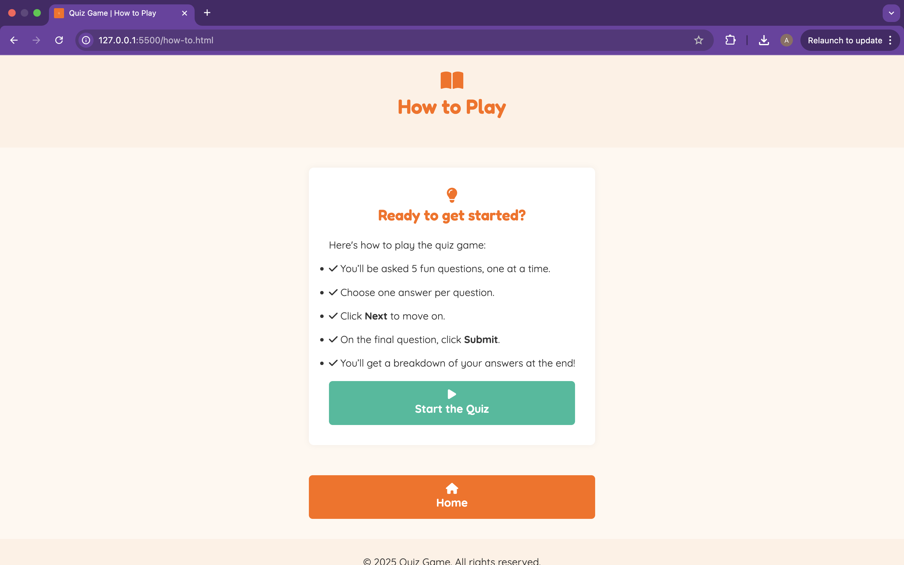
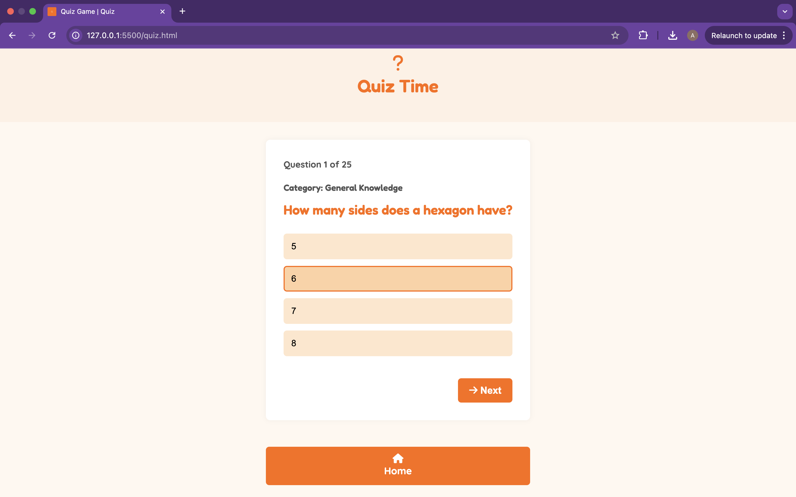
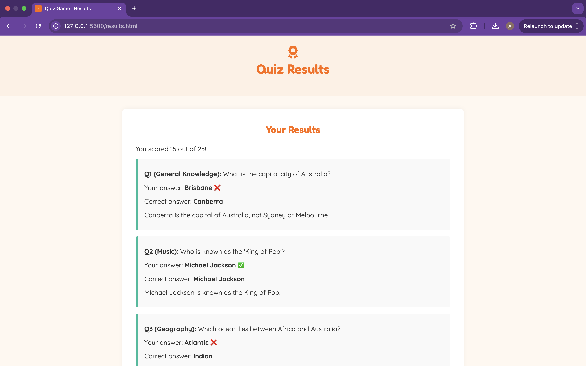
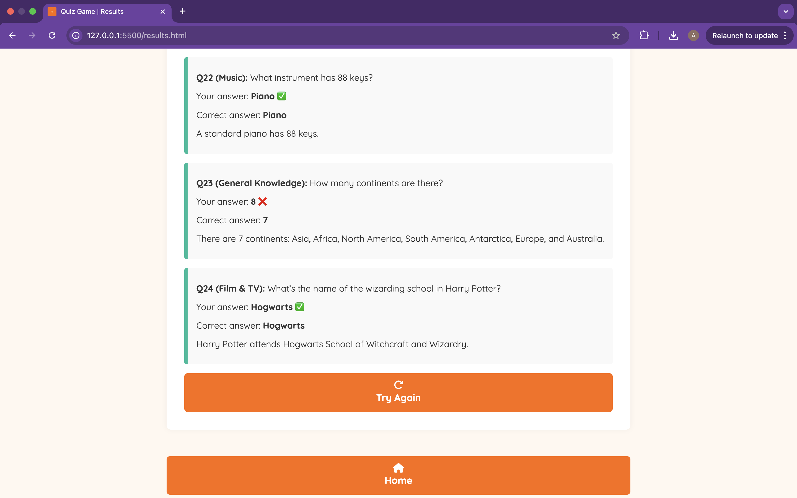
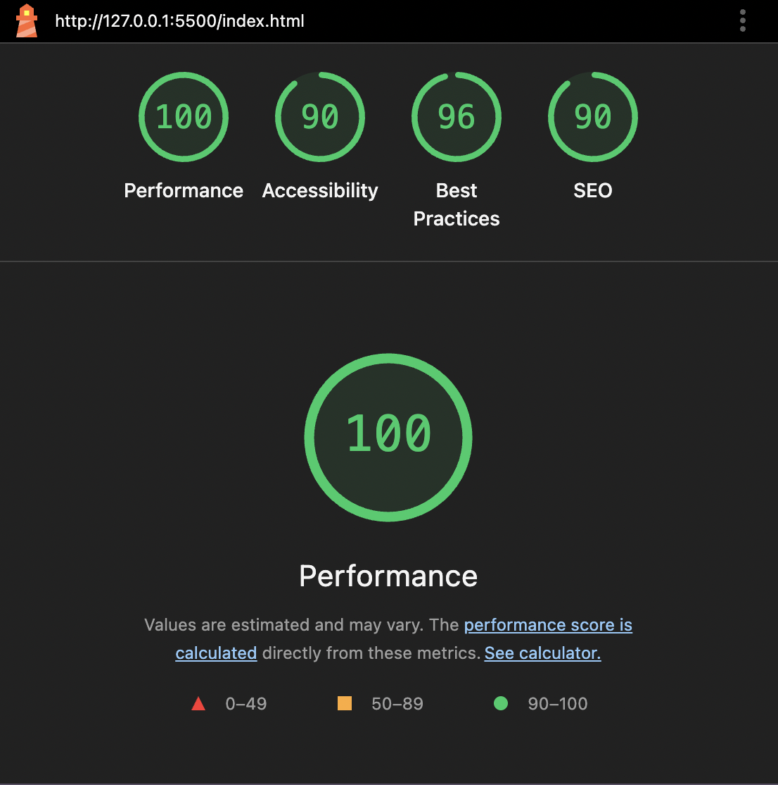
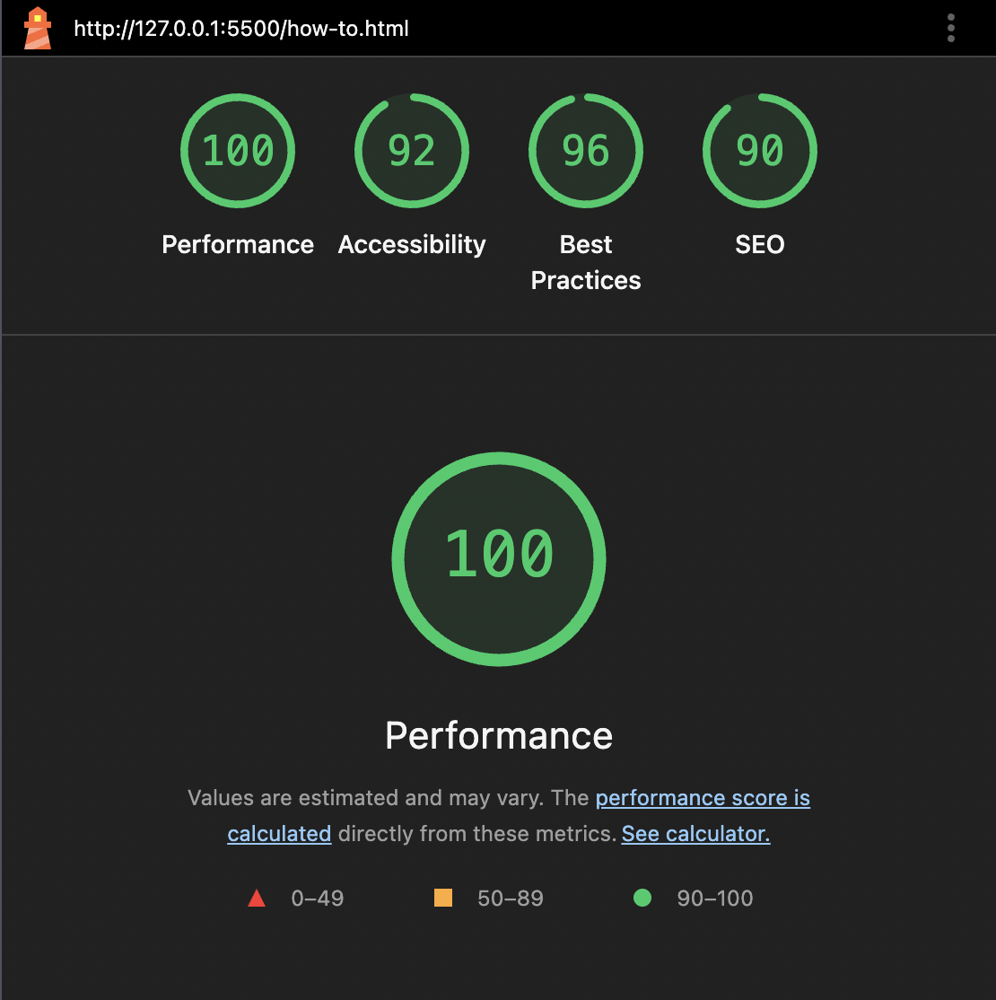
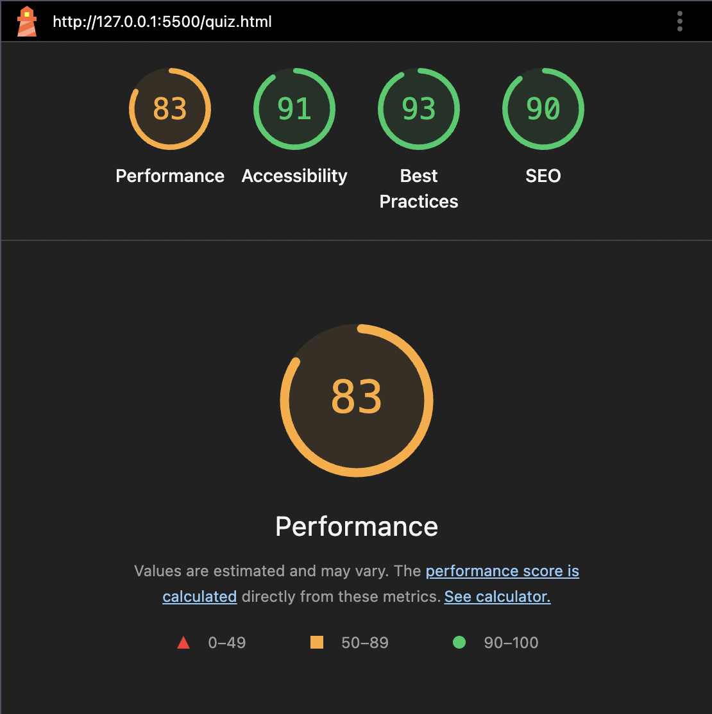

# Project 3: Online Quiz Website

Welcome to the **Online Quiz Website** — a fun, fully responsive, and interactive quiz game built using **HTML, CSS, and JavaScript**. This project was developed as part of a front-end development portfolio and fully aligns with the Project 3 brief requirements.

---

## 🔗 Live Demo

**GitHub Pages Deployment:** [Play the Quiz](https://alfiecross.github.io/Project-3-Online-Quiz/)

**GitHub Repository:** [github.com/AlfieCross/Project-3-Online-Quiz](https://github.com/AlfieCross/Project-3-Online-Quiz)

---

## 🎯 Project Aims

- Build a professional quiz website with structured layout and navigation
- Use semantic HTML5, CSS3, and vanilla JavaScript
- Ensure accessibility and responsiveness across all devices
- Follow project brief requirements for structure, interactivity, testing, and deployment

---

## 🚀 Features

- ✅ 25 randomized multiple-choice questions across 5 categories:
  - General Knowledge
  - Geography & Landmarks
  - Sports
  - Music
  - Film & TV
- ✅ User-friendly interface with accessible layout and color contrast
- ✅ Visual feedback on answer selection with category labels
- ✅ Quiz progress tracker and score calculation
- ✅ Results page showing all answers, explanations, and score
- ✅ Responsive design using mobile-first media queries
- ✅ Accessible semantic HTML structure and keyboard navigation
- ✅ Modular JavaScript structure split into `main.js`, `questions.js`, `quiz.js`, `results.js`
- ✅ LocalStorage to persist answers and score between pages
- ✅ Home button for easy navigation across all pages
- ✅ Favicon and manifest for browser branding

---

## 🧱 File Structure

```
Project-3-Online-Quiz/
├── assets/
│   ├── css/
│   │   └── styles.css
│   ├── icons/
│   │   ├── android-chrome-192x192.png
│   │   ├── android-chrome-512x512.png
│   │   ├── apple-touch-icon.png
│   │   ├── favicon-16x16.png
│   │   ├── favicon-32x32.png
│   │   ├── favicon.ico
│   │   └── site.webmanifest
│   ├── js/
│   │   ├── main.js
│   │   ├── quiz.js
│   │   ├── questions.js
│   │   └── results.js
│   └── screenshots/
│       ├── home.png
│       ├── how-to.png
│       ├── quiz-in-progress.png
│       ├── results.png
│       └── mobile-view.png
├── index.html
├── how-to.html
├── quiz.html
├── results.html
└── README.md
```

---

## 📸 Screenshots

Here are key screenshots showcasing the project:

### Home Page


### How to Play Page


### Quiz In Progress


### Results Page



---

## 📊 Lighthouse Reports

All major pages were tested using Google Lighthouse on desktop. Below are the results:

| Page         | Performance | Accessibility | Best Practices | SEO |
| ------------ | ----------- | ------------- | -------------- | --- |
| index.html   | 100         | 90            | 96             | 90  |
| how-to.html  | 100         | 92            | 96             | 90  |
| quiz.html    | 83          | 91            | 93             | 90  |
| results.html | 100         | 90            | 96             | 90  |

### 🔍 Screenshots of Lighthouse Results:

**Home Page**  


**How to Play Page**  


**Quiz Page**  


**Results Page**  


---

## ✅ Testing & Validation

- HTML and CSS validated using W3C validator
- JavaScript tested in Chrome, Firefox, Safari
- Fully functional on mobile, tablet, desktop
- Accessibility checks passed (keyboard navigation, color contrast, semantic markup)
- Quiz tested multiple times to ensure correct scoring and data persistence

---

## 🧠 Key Learnings

- DOM manipulation and interactive UI design with vanilla JavaScript
- Modular file structure for maintainability and clarity
- Responsive design using media queries and flexible layouts
- LocalStorage usage for passing quiz state between pages
- Professional deployment with GitHub Pages and consistent version control

---

## 🔮 Future Improvements

- Allow users to select categories or difficulty levels
- Add timer and challenge mode
- Track and save high scores across sessions
- Add animations or sound effects for more engagement
- Improve ARIA support for screen readers

---

## 📜 Credits

- Fonts: [Google Fonts - Fredoka](https://fonts.google.com/specimen/Fredoka), [Quicksand](https://fonts.google.com/specimen/Quicksand)
- Icons: [Font Awesome](https://fontawesome.com/)
- Favicon Generator: [Real Favicon Generator](https://realfavicongenerator.net/)
- Deployment: [GitHub Pages](https://pages.github.com/)

---

## 👨‍💻 Author

**Alfie Cross**\
Front-End Developer Portfolio Project – 2025
